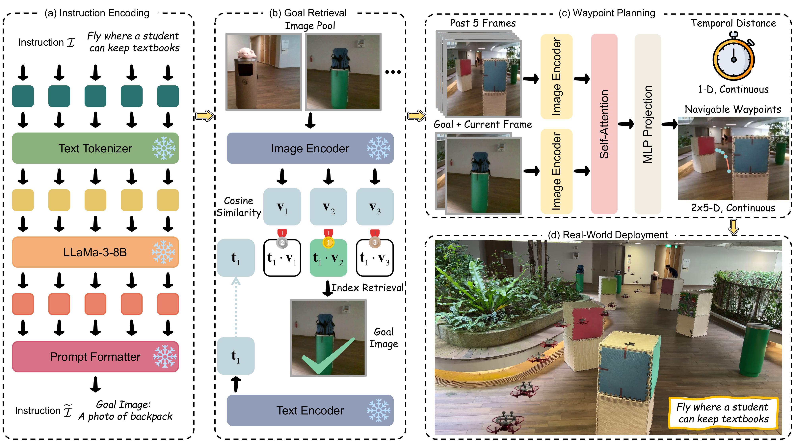
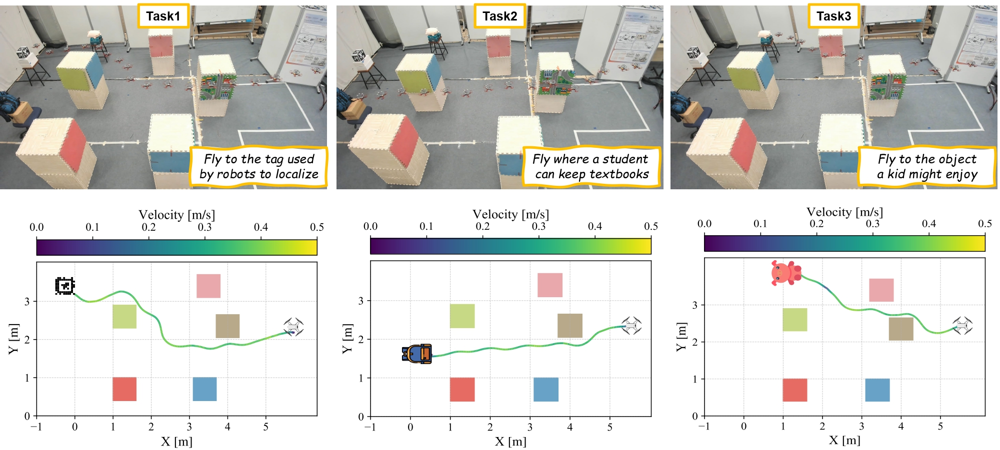
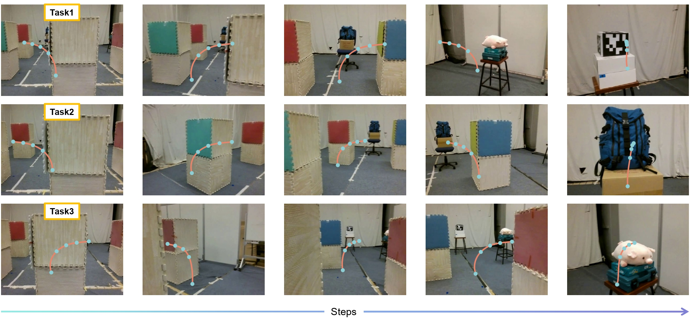
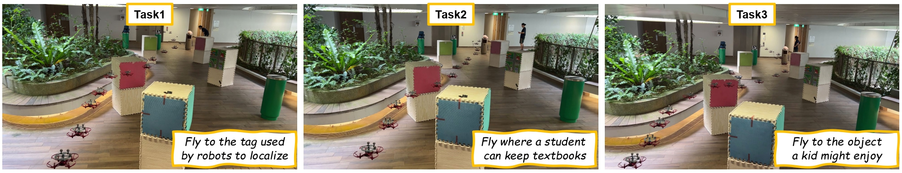
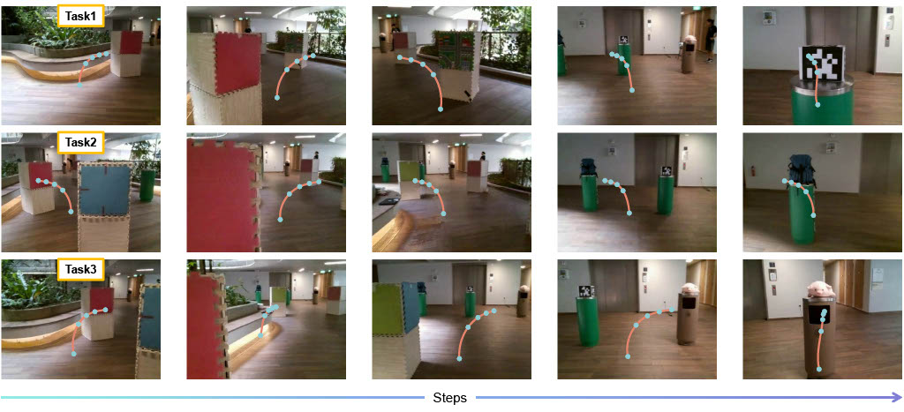

# VLFly: Grounded Vision-Language Navigation for AAVs with Open-Vocabulary Goal Understanding

🤖 VLFly is a grounded vision-language navigation system for AAVs with open-vocabulary goal understanding.

⚠️ We currently release only the real-world deployment code; the simulation environment is still under development and is therefore not included in this open-source release.

<p align="center">
  
</p>

<p align="center">
  
  
</p>

<p align="center">
  
  
</p>

<a id="readme-top"></a>

## Table Of Contents

- [About The Project](#about-the-project)
- [Repository Structure](#repository-structure)
- [Installation](#installation)
- [Model And Asset Configuration](#model-and-asset-configuration)
- [Running The System](#running-the-system)
- [Important Parameters](#important-parameters)
- [Citation](#citation)
- [Acknowledgement](#acknowledgement)

## About The Project

VLFly combines three components in one runtime stack:

1. `LLaMA` interprets a natural-language navigation request and maps it to a supported goal description.
2. `CLIP` compares the grounded goal text with the endpoint images of candidate topomaps.
3. A `ViNT-compatible navigation policy` localizes within the selected topomap and predicts waypoint actions online from monocular RGB observations.

The current release is a deployment-oriented codebase. It does not include the original training pipeline. The `deployment/src/vint_train/` package is kept only as a lightweight compatibility shim for loading the navigation checkpoint format used by ViNT-style models.

## Repository Structure

```text
vlfly/
├── Assets/                        # Framework and result figures used in the README
├── environment.yaml               # Conda environment exported from the development setup
├── deployment/
│   ├── config/
│   │   ├── models.yaml            # Checkpoint path registry
│   │   ├── robot.yaml             # Robot control limits and frame rate
│   │   └── vlfly.yaml             # Inference-time model architecture config
│   ├── model_weights/             # Place the VLFly / ViNT-compatible checkpoint here
│   ├── src/
│   │   ├── CLIP/                  # Vendored OpenAI CLIP package
│   │   ├── navigate_real.py       # Language grounding + topomap selection + navigation
│   │   ├── tello_flight.py        # Tello video bridge and control publisher
│   │   ├── topic_names.py         # ROS topic names
│   │   ├── utils.py               # Model loading and image preprocessing
│   │   ├── vint_train/            # Checkpoint compatibility shim
│   │   └── vlfly/                 # Navigation model definition
│   └── topomaps/
│       └── images/                # Numbered images for each topomap candidate
└── README.md
```

## Installation

### 1. Clone The Repository

```bash
git clone git@github.com:zzzzzyh111/Vision-Language-Fly.git
cd vlfly
```

### 2. Create The Conda Environment

```bash
conda env create -f environment.yaml -n vlfly
conda activate vlfly
```

`environment.yaml` is an exported development environment. If your local `conda` setup complains about the final `prefix:` line, remove that line before creating the environment.

### 3. Install Runtime Packages Missing From The Exported Environment

The current runtime also depends on the vendored CLIP package and several Python packages used by the flight bridge.

```bash
pip install -e deployment/src/CLIP
pip install av opencv-python tellopy
```

### 4. Prepare ROS

The real-robot pipeline expects a working ROS environment with Python access to:

- `rospy`
- `sensor_msgs`
- `std_msgs`
- `cv_bridge`

Source your ROS installation before running the scripts. For example:

```bash
source /opt/ros/noetic/setup.bash
```

Ubuntu 20.04 + ROS Noetic + Python 3.8 is the most natural target for the current codebase.

## Model And Asset Configuration

The project needs three model families at runtime: `LLaMA`, `CLIP`, and the `vint.pth` navigation checkpoint from the official ViNT repository.

### 1. LLaMA Configuration

`deployment/src/navigate_real.py` currently uses:

```python
model="meta-llama/Meta-Llama-3-8B-Instruct"
```

Before running:

1. Request access to `meta-llama/Meta-Llama-3-8B-Instruct` on Hugging Face.
2. Log in locally:

```bash
huggingface-cli login
```

3. On first run, `transformers` will download the model into your Hugging Face cache.

If you want to use a local checkpoint or a different language model, edit the `model=` argument inside `deployment/src/navigate_real.py`.

### 2. CLIP Configuration

This repository vendors the OpenAI CLIP Python package under `deployment/src/CLIP/`. After installing it with:

```bash
pip install -e deployment/src/CLIP
```

the navigation script loads:

```python
clip.load("ViT-B/32", device=clip_device)
```

On first use, CLIP downloads the `ViT-B/32` weights into the default CLIP cache under `~/.cache/clip`. If you plan to run offline, make sure the model is downloaded once in advance on the target machine.

### 3. ViNT Navigation Checkpoint

Please download `vint.pth` from the official ViNT repository and place it at:

```text
deployment/model_weights/vint.pth
```

The default registry is:

```yaml
vlfly:
  config_path: ../config/vlfly.yaml
  ckpt_path: ../model_weights/vint.pth
```

in `deployment/config/models.yaml`.

Official ViNT repository:

- https://github.com/robodhruv/visualnav-transformer

If you store `vint.pth` elsewhere, update `ckpt_path` in `deployment/config/models.yaml`.

`deployment/config/vlfly.yaml` defines the inference-time model architecture and should stay consistent with the downloaded `vint.pth` checkpoint.

### 4. Topomap Images

The provided topomap images are only partial examples for guidance and for basic initial testing. For real deployment, users should recollect topomap images for their own scenes.

The navigation stack expects numbered image sequences for each topomap under:

```text
deployment/topomaps/images/topomap1/
deployment/topomaps/images/topomap2/
deployment/topomaps/images/topomap3/
```

Important conventions:

- Images should be named with integer filenames such as `0.png`, `1.png`, `2.png`, ...
- The last image in each topomap is used by CLIP as the endpoint candidate for language-conditioned topomap selection.
- After a topomap is selected, the full image sequence is used for localization and waypoint prediction.

If you want to use different topomap names, update the `GOAL_DIR` list in `deployment/src/navigate_real.py`.

### 5. Supported Goal Vocabulary

The current goal vocabulary is intentionally simplified, and users can modify it according to their own targets and tasks.

The current script uses the following default grounded goal candidates:

```python
options = ["AprilTag", "blue backpack", "pink pig"]
```

LLaMA maps the user instruction to one of these candidates, and CLIP then scores the topomap endpoints against the resulting text prompt. To add or replace goal objects, edit the `options` list in `deployment/src/navigate_real.py` and make sure the new targets are visually represented in your topomap endpoints.

## Running The System

The code is designed around a ROS-based deployment loop.

### 1. Start ROS Master

```bash
source /opt/ros/noetic/setup.bash
roscore
```

### 2. Start The Tello Flight Bridge

In a new terminal:

```bash
source /opt/ros/noetic/setup.bash
conda activate vlfly
cd deployment/src
python3 tello_flight.py
```

This script:

- connects to the Tello
- starts the video stream
- publishes RGB frames on `/front_cam/camera/image`
- listens for waypoint commands on `/waypoint`
- listens for goal completion on `/topoplan/reached_goal`

It also records the FPV stream to `deployment/src/vlfly_fpv.mp4`.

### 3. Start Language-Grounded Navigation

In another terminal:

```bash
source /opt/ros/noetic/setup.bash
conda activate vlfly
cd deployment/src
python3 navigate_real.py -m vlfly
```

You will be prompted with:

```text
Navigation Task Description:
```

Enter a natural-language instruction such as:

```text
fly to the backpack
```

The script then uses LLaMA to ground the instruction, CLIP to select the topomap, and the navigation policy to publish waypoints until the goal is reached.

When the goal is reached, the final observation is saved to:

```text
deployment/topomaps/Final.png
```

## Important Parameters

### Command-Line Arguments In `navigate_real.py`

| Argument | Default | Meaning |
| --- | --- | --- |
| `--model`, `-m` | `vlfly` | Key in `deployment/config/models.yaml` used to select the checkpoint and model config |
| `--waypoint`, `-w` | `4` | Index of the predicted waypoint used for control |
| `--goal-node`, `-g` | `-1` | Target node index in the selected topomap. `-1` means the last node |
| `--close-threshold`, `-t` | `5` | Distance threshold for advancing to the next topomap node |
| `--radius`, `-r` | `2` | Number of nearby nodes considered during localization |

### Robot Parameters In `deployment/config/robot.yaml`

| Parameter | Default | Meaning |
| --- | --- | --- |
| `max_v` | `0.3` | Maximum linear speed scaling used after waypoint normalization |
| `max_w` | `0.6` | Maximum yaw rate used by the PD controller |
| `frame_rate` | `10` | Control loop rate used by the navigation node |

## Citation

If you find this work useful, please cite:

```bibtex
@article{zhang2025grounded,
  title={Grounded vision-language navigation for uavs with open-vocabulary goal understanding},
  author={Zhang, Yuhang and Yu, Haosheng and Xiao, Jiaping and Feroskhan, Mir},
  journal={arXiv preprint arXiv:2506.10756},
  year={2025}
}
```

## Acknowledgement

This repository builds on the ideas and checkpoint format of Visual Navigation Transformer. If you are looking for the original ViNT codebase, training setup, or the upstream project context, please refer to the official repository:

- ViNT official repository: https://github.com/robodhruv/visualnav-transformer

<p align="right">(<a href="#readme-top">back to top</a>)</p>
